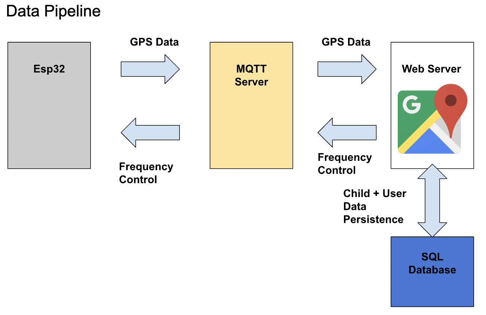
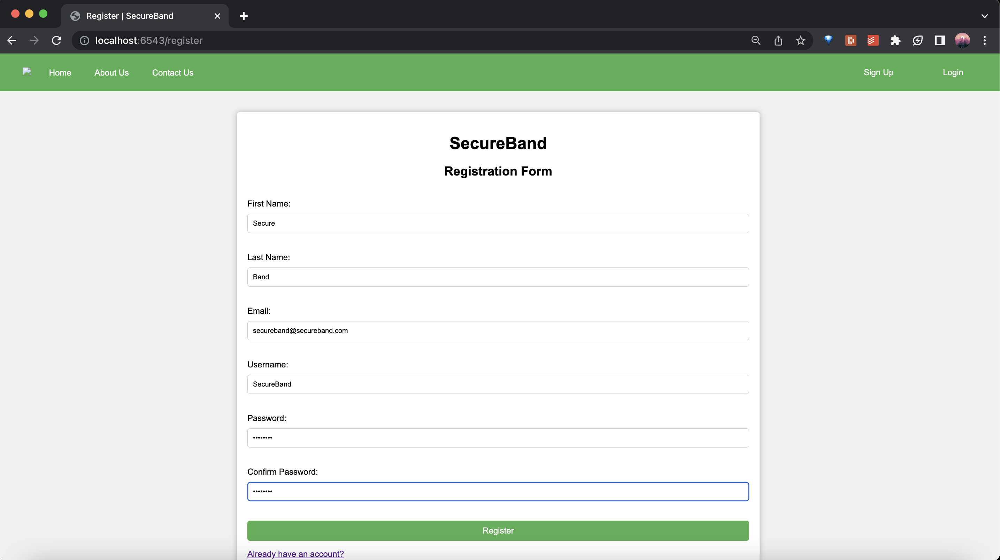
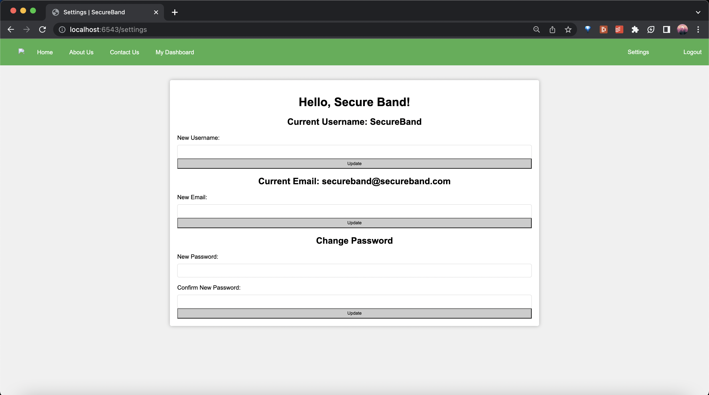

# Overview

Welcome to the SecureBand code repository! 

The **SecureBand** is an IoT GPS tracking device that can be used for parents or caretakers to keep track of their children, patients, or elderly individuals’ locations.

Since the SecureBand is an IoT device, both hardware and software are incorporated. On the hardware side, an ESP32 microcontroller is used to send GPS coordinate data via bluetooth to an external MQTT server. 
On the software side, we created a web server using Python’s FastAPI framework on the backend and Vanilla Javascript + HTML/CSS on the frontend. There are features to register an account, login, manage account settings, manage child devices, view child locations, and view emergency contact pages. 
The backbone of communications between hardware and software is through MQTT communications, and 
data persistence in our application revolves around  information stored into our MySQL database.

Here is a helpful visualization of the different interactions within our application:



# Requirements to Run

For the software, you will need a version **Python3** installed onto your machine. This can be obtained using a condas environment such as anaconda or miniconda. You will also need the libraries ```fastapi```, ```uvicorn```, ```os```, ```json```, ```connect```, ```asyncio```, ```mysql```, ```bcrypt```, and ```dotenv```. 
These are quite a few, so feel free to look up how to properly import each of them online. You will also need ***MySQL*** installed onto your machine. Once you have that installed, change the fields in ```credentials.env``` file to match your MySQL user and password.
Then, you must run the script ```init-db.sql``` in your MySQL session to create the database used for the SecureBand.
In MySQL, you should have a database called ```SecureBand``` with 

For the hardware, you will need a physical ESP32 device. You have to register this on to an MQTT broker side such as https://www.hivemq.com/ and set up different subscription channels and change the fields in ```connect.py``` appropriately.

Once everything is set up, simply run the file ```main.py``` to start the server. You can the go to ```localhost:6543``` on your browser to access the SecureBand web application!

# Web Application Overview

Homepage


Registration Page


Dashboard


Emergency Contact


Settings


# Hardware Overview
TODO: Edward

# Limitations
For our MVP (minimum viable product), we only had access to a single ESP32 unit, meaning we could only track a single child device at a time. Our current version of the SecureBand is hardcoded to link the first child created on a user account with the single ESP32. This works in demonstrating the basic functionality of the SecureBand, but our hope in a future iteration is to optimize our code to handle multiple ESP32s at once and display them simultaneously on the map display.

Also, due to time constraints, we were unable to implement some nice to have features. For one, we could not implement the 'Forgot Password' protocol, so clicking on that link will do nothing. Of course in a real SecureBand it is important for users to access their accounts even if they forgot their password, but we wanted to focus on the more important features for this version such as actually sending GPS location via MQTT and displaying it on the webpage.

We also only have a web application as a form of accessing media. Ideally, having a mobile app for iOS and Android would be eseential in a final product. This would be advantageous in that users could access the SecureBand application without Wifi limitations, and be able to scan the QR code on the physical SecureBand device to be redirectted to that child's emergency contact page.

Overall, there were many more things we could have added to this MVP. But afterall, we are all just busy college students, and this class definitely had a lot of work other than this project itself. But in the end, we did manage to come up with a decent and viable first iteration of our SecureBand.

# Credits

TODO